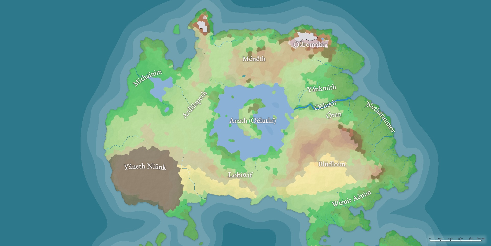

# Of Anmahta

In the Rending Teretz received only four continents, generally smaller than our own. It also received innumerable islands. Here the most prominent of the continents is described. The names of its lands and features are included and in some cases loosely translated (for in all Teretz there is magic to translate any tongue, but proper names are usually unaffected).

Before the Rending, most men dwelt in the regions we know as Northern Africa and the Middle East. These lands being removed from Teretz, the people who remained were taken up and placed on the far northwest of a yet unexplored continent. So they named it Anmahta, the First-land. No one has ever fully measured Anmahta by our own measures, but estimates from the accounts we have suggest it is slightly smaller than the continental United States. The region where most first arrived was near to a great river, so they called the place Lanísan, (roughly "beginning at the river"). The terrain faded gradually from thick rainforest in the east to clean grasslands in the west. The river they first called Anvrilénk, for it made the land around fruitful. But it happened that the river joined a great lake with the outer ocean, so that as they began to sail it, it was renamed Oëlukîr, the Sea-road.

In time it was realized that the “lake” was in fact much greater than a lake. It was soon named the Oëlímeth. The name seems to have derived from something like “sun sea,” and this may be because from all around the sea, it flamed and glittered with a brilliant shine under the noon. Over time the true extent of the sea became known, and in the final accounts it was said to be nearly a circle and almost 700 miles wide. It sat in the center of Anmahta, and in all the journeys men took there, they wheeled around it on one side or the other until they could sail.

The first movements from Lanísan were north, but after much travel the lands became cold and dead. This region was named Ôsbomahta, the Icy Land. Very few people ever lived there, and dark creatures came to fill it, but rumors suggest that eventually these creatures were driven out by the elves, and they established a kingdom there hidden in the ice and snow.

People then began moving westward. This move was stalled for many years because they soon came upon great mountains, and they named the land Ménêth (Rocky). Some men settled in the mountains and wandered their peaks as nomads, but these were few. Only after the coming of the elves were men able, by elvish aid, to make paths through the mountains to the lands beyond.

West of Ménêth, the land descends through forests until it begins to curve southward, except for one curious peninsula to the north. On it stands a high mountain, thickly blanketed in snow, and few ever moved that way. The mountain was named Maedamë (Spell Tower). Rumors say that the ice and snow of Maedamë conceal a great fortress to which strong and terrible wizards retreat for solitude and learning. Though few witnesses exist, in the common lore this fortress is named Wachüthmü (Wizard Castle). Many people, however, did come to settle in the region between the edges of Ménêth and the slopes of Maedamë.

Those who went south after Ménêth continued over lower and flatter rocks for some way until they came to some grasslands followed by a short strip of desert terminated by a line of hills. Those who tried to go west around the hills soon came to vast forests around a huge lake. They named the region Míthaenim (Wet Forests), and it became home to countless happy men. Those who crossed the hills, by contrast, found seemingly endless grassy plains, thus named Ardíñapeth. For many years, this was as far as men would travel, for going any further seemed a great risk for little reward.

Around the time the men first passed Ménêth, people began to cross the river Oëlukîr, and the land immediately south of it was called Óran, which means “across the river.” The land there was full of marshes and bogs, but on its eastern edge it met the ocean in what many have said are the most beautiful beaches in either Earth or Teretz. They were long and white, with the clearest waters in Anmahta. As the sun rose over them, some peculiar quality of the sands there caused them to sparkle with every color. For one or two weeks in the year this effect was so strong that miles of beach appearing to be flaming in rainbow. So they were named Nethátmimor, Rainbow-shore. And for many ages, whenever this sight appeared, the people who dwelt there would cease all work and give themselves to celebration until the last glimmer of color faded.

South of Óran and southwest of Nethátmimor was Plûhethíf Ménêim, the Endless Mountains. These were hard and treacherous, and no one dared scale or claim them for centuries. Eventually, however, men travelled around them to find a great desert, hundreds of miles across. In the north it gradually sloped into the mountain range, so it was named Blüdloim, the Dry Hills.

Those who finally ventured south of Ardíñapeth without turning to the east came to regret it. For the vast lands in the southwestern corner of Anmahta were called Yâneth Niünk, Magic Wasteland. The fortress of the Great Magician was still there in the center, and all of the lands around it for hundreds of miles were black and dead. Nothing grew there, and nothing lived there except for dark and unnatural creatures fashioned during the War. To this day not an inch of the land has been restored, but it is said that when the Reconciliation is complete, all the black will turn green, and nowhere in Earth or Teretz will be able to rival its beauty. Then it shall be renamed Kegrair, and its old fortress will crumble, and in its place a son of the Six will build a palace dedicated to Eléos.

It was long before men had the courage to even pass beyond the Yâneth Niünk even by going around it, but eventually many did. To the east, the land begins to fall quickly in the south into a harsh desert irrigated by a single river, and in the north the land declines much more slowly into seaside forests. Separating much of the north and the south is a range of hills, so the region was named Lobiẅif (roughly “divided by hill”). The northern half quickly became populous, but the southern half was largely uninhabited except on the banks of the river, named Üifênn (Source of Life), for at least a hundred years after it was discovered.

Passage beyond Lobiẅif was slow, as men were quite content to settle in the northern forests by the sea, and the desert in the south presented travelers with great difficulty. Nonetheless, restless as men are, no obstacle held them back for more than a generation before they continued. They found that after the hills was a great valley, on the other side of which was a range of mountains much higher than anything yet seen south of Ménêth. This was the same Plûhethíf Ménêim discovered by travelers from Óran. To the north, some travelers hugged the sea on the lower forested slopes until eventually coming into Óran itself. South of the mountains, men came to Blüdloim and met those who had came there from Nethátmimor in the east.

Finally, on the southern end of the continent below Nethátmimor and Blüdloim lay a wide stretch of warm forests. From Nethátmimor came the first few travelers, but settlements grew slowly because, from the one side, these lands were less abundantly watered, and, from the other, traveling across Blüdloim was very difficult. Even so, the land was healthy and pleasant, so over time the population grew sizably to produce three nations, and the region itself was named Wemir Aënim, the Lower Woods.

South of the Wemir Aënim, there is a narrow land between the oceans connecting Anmahta to the Southern Realm, also called Nichlif Eïrâch. Few people passed on to there in the oldest days, and of the doings there little news has ever reached our world. It is said that the peoples and lands of Nichlif Eïrâch are even more various and splendid than those known in Anmahta, and the adventures and history there no less amazing than those I will be recounting. But their stories are not the most important story and do not pertain to the comings and goings between Teretz and Earth, in which I am alone interested.

One important land remains in Anmahta. After men began to sail Oëluímeth, they found a large island, roughly crescent-shaped, near the sea’s center. It was named in this time Oëluthí, Sea-moon. However, in later times this name was nearly forgotten, replaced by the more infamous name of Anath, for this island became the domain of the Anathim after their rebellion. It was then surrounded by a magic ring of perpetual storms which prevented any man from entering and leaving the island, which was not broken for centuries. The wars between the Terethim and the Anathim began when Eléos gave the land to Tereth and his descendants.

Following is a reconstructed map drawn from several sources, including a number of written descriptions, a few regional maps, and one very dubious map of the whole continent drawn by the first inhabitants of Wemir Aënim, made from their traditions of the journeys which had brought them there after many years.

